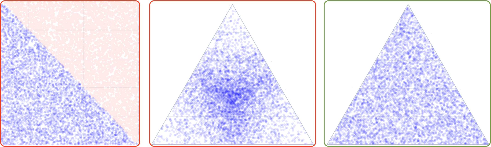
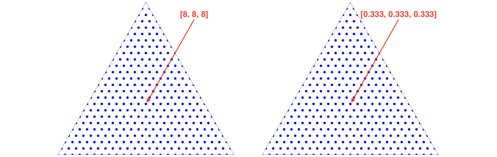
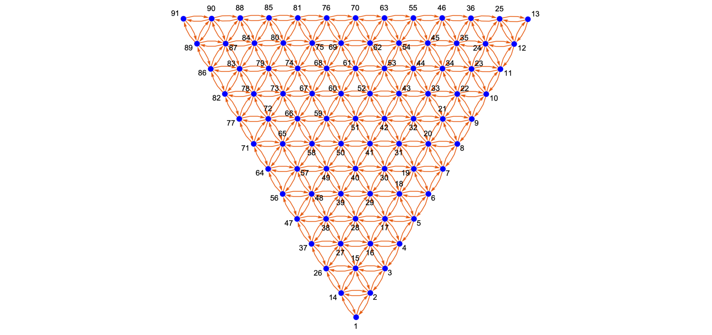
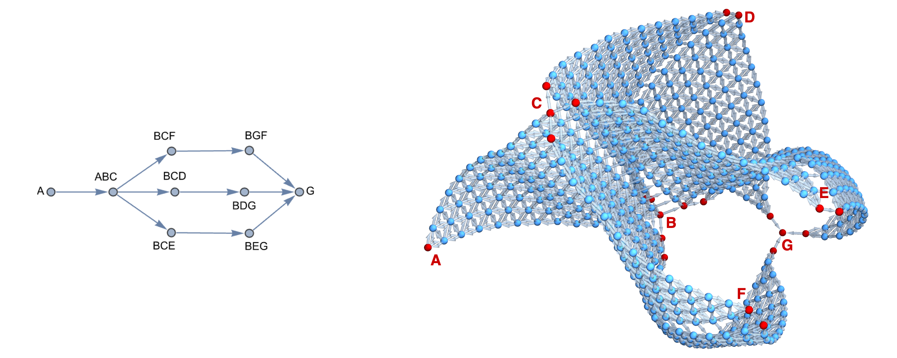

# nimplex


[](https://opensource.org/licenses/MIT)

[](https://github.com/amkrajewski/nimplex/actions/workflows/testingOnPush_Linux.yaml)
[](https://github.com/amkrajewski/nimplex/actions/workflows/testingOnPush_Apple.yaml)
[](https://github.com/amkrajewski/nimplex/actions/workflows/testingOnPush_Windows.yaml)

**NIM** sim**PLEX**: A concise high-performance scientific Nim library (with CLI and Python binding) providing samplings, uniform grids, traversal graphs, and more in compositional (simplex) spaces, where traditional methods designed for euclidean spaces fail or otherwise become impractical.

Such spaces are considered when an entity can be split into a set of distinct components (a composition), and they play a critical role in many disciplines of science, engineering, and mathematics. For instance, in materials science, chemical composition refers to the way a material (or, more generally, matter) is split into distinct components, such as chemical elements, based on considerations such as fraction of atoms, occupied volume, or contributed mass. And in economics, portfolio composition may refer to how finite capital is split across assets, such as cash, equity instruments, real estate, and commodities, based on their monetary value.

## Installation
There are several **easy** ways to quickly get *nimplex* up and running on your system. The choice depends primarily on your preffered way of interacting with the library (CLI, Nim, or Python) and your system configuration.

If you happen to be on one of the common systems (for which we auto-compile the binaries) and you do not need to modify anything in the source code, you can simply download the latest release from the [nimplex GitHub repository](https://github.com/amkrajewski/nimplex)
and run the executable (*nimplex* / *nimplex.exe*) or Python library (*nimplex.so* / *nimplex.pyd*) directly just by placing it in your working directory and using it as:

1. An **interactive command line interface (CLI) tool**, which will guide you through how to use it if you run it without any arguments like so (on Linux/MacOS):
   ```cmd
   ./nimplex   
   ```
   or with a concise configuration defining the task type and parameters (explained later in [Usage in Nim](#usage-in-nim)):
   ```cmd
   ./nimplex -c IFP 3 10
   ```
2. An **compiled Python library**, which you can import and use in your Python code like so:
   ```python
   import nimplex
   ```
   and immediately use the functions provided by the library, as described in [Usage in Python](#usage-in-python):
   ```python
   nimplex.simplex_internal_grid_fractional(dim=3, ndiv=10)
   ```

If the above doesn't work for you, or you want to modify the source code, you can compile the library yourself fairly easily in a couple minutes. 
The only requirement is to have [Nim](https://nim-lang.org/) installed on your system
([Installation Instructions](https://nim-lang.org/install.html)) which can be done on most Linux distributions with a single command:
```cmd
apt-get install nim
```
or on MacOS, assuming you have [Homebrew](https://brew.sh/) installed:
```cmd
brew install nim
```

Then, you can use the boundeled [Nimble](https://github.com/nim-lang/nimble) tool (pip-like package manager for Nim) to install two top-level dependencies: 
[arraymancer](https://github.com/mratsim/Arraymancer), which is a powerful N-dimensional array library, and [nimpy](https://github.com/yglukhov/nimpy) which 
helps with the Python bindings. You can do it with a single command:
```cmd
nimble install  -y arraymancer nimpy
```

Finally, you can clone the repository and compile the library with:
```cmd
git clone https://github.com/amkrajewski/nimplex
cd nimplex
nim c -r -d:release nimplex.nim -benchmark
```
which will compile the library and run a few benchmarks to make sure everything runs smoothly. You should then see a compiled binary file `nimplex` in the current directory which exposes the CLI tool.
If you want to use the Python bindings, you can compile the library with slightly different flags (depending on your system configuration) like so for Linux/MacOS:
```cmd
nim c --d:release --threads:on --app:lib --out:nimplex.so nimplex
```
and you should see a compiled library file `nimplex.so` in the current directory which can be immediately imported and used in Python.


## Capabilities
***Note:*** Full technical discussion of methods and motivations is provided in the manuscript. The sections below are meant to provide a concise overview of the library's capabilities.

The library provides a growing number of methods specific to compositional (simplex) spaces:
1. **Monte Carlo sampling** is the simplest method conceptually, where points are rendomly sampled from a simplex. In low dimensional cases, this can be accomplished by sampling from a uniform distribution in (d-1)-Cartesian space and then rejecting points outside the simplex (left panel below). However, in this approach, the inefficiency growth is **factorial** with the dimensionality of the simplex space. Instead, some try to sample from a uniform distribution in (d)-Cartesian space and normalize the points to sum to 1, however, this leads to over-sampling in the center of each simplex dimension (middle panel below). 

   One can, however, fairly easily sample from a special case of Dirichlet distribution, as explained in the manuscript, which leads to uniform sampling in the simplex space (right panel below). **Nimplex can sample around 10M points per second in 9-dimensional space** on a modern CPU.

   
   
2. **Simplex / Compositional Grids** are a more structured approach to sampling, where all possible compositions quantized to a given resolution, like 1% for 100 divisions per dimension, are generated. This is useful for example when one wants to map a function over the simplex space. In total `N_S(d, n_d) = \binom{d-1+n_d}{d-1} = \binom{d-1+n_d}{n_d}` are generated, where `d` is the dimensionality of the simplex space and `n_d` is the number of divisions per dimension. Nimplex uses a modified version of NEXCOM algorithm to do that procedurally (see manuscript for details) and can generate around **5M points per second in 9-dimensional space** on a modern CPU. A choice is given between generating the gird as a list of **integer** numbers of quantum units (left panel below) or as a list of **fractional positions** (right panel below). 
   

3. **Internal Simplex / Compositional Grids** are a modification of the above method, where only points inside the simplex, i.e. all components are present, are generated. This is useful in cases where, one cannot discard any component entirely, for instance, because manufacturing setup has minimum feed rate (leakage). Nimplex introduces a new algorithm to generate these points procedurally (see manuscript for details) based on further modification of NEXCOM algorithm. 

   In total `N_I(d, n_d) = \binom{n_d-1}{d-1}` are generated, critically without any performance penalty compared to the full grid, which can reach orders of magnitude when `d` approaches `n_d`. Similar to the full grid, a choice is given between generating the gird as a list of **integer** numbers of quantum units or as a list of **fractional positions**.

4. **Simplex / Compositional Graphs** generation is ***the most critical capability***, first introduced in the nimplex manuscript. They are created by using combinatorics and disocvered patterns to assign edges between all neighboring nodes during the simplex grid (graph nodes) generation process. Effectively, a traversal graph is generated, spanning all possible compositions (given a resolution) creating an extremely efficient representation of the problem space, which allows deployment of numerous graph algorithms. 

   
   
   Critically, unlike the O(N^2) distance-based graph generation methods, this approach **scales linearly** with the resulting number of nodes. Because of that, it is extremely efficient even in high-dimensional spaces, where the number of edges goes into trillions and beyond. Nimplex can **both generate and find neighbors** for around **2M points per second in 9-dimensional space** on a modern CPU. 
   
   As explored in the manuscript, such representations, even of different dimensions, can can then be used to efficeintly encode complex problem spaces where some prior assumptions and knowledge are available. In the Example #2 from manuscript, inspired by problem of joining titanium with stainless steel in [10.1016/j.addma.2022.102649](https://doi.org/10.1016/j.addma.2022.102649) using 3-component spaces, one encode 3 separate paths where some components are shared in predetermined fashion. This to efficiently encode the problem space in form of a structure graph (left panel below and then use it to construct a single **simplex graph complex** (right panel below) as a single consistent structure.

   

Several other methods are in testing and will likely be added in the future releases. If you have any suggestions, please open an issue on GitHub as we are always soliciting new ideas and use cases based on real-world problems in the 
scientific computing community.

## Usage in Nim
Usage within Nim is fairly straightforward. You can install it using Nimble as explained earlier, or install it directly from GitHub:
```cmd
nimble install -y https://github.com/amkrajewski/nimplex
```
or, if you wish to modify the source code, you can simply download the core file `nimplex.nim` and place it in your own code, as long as you have the dependencies installed, since it is standalone. 
**Then simply follow the API documentation below.**

## Usage in Python
To use the library in Python, you can interact with it just like any other Python library. All input/output types are native Python types, so no additional conversion is necessary. Once you have the library installed and imported,
**simply follow the API documentation below, with an exception that you need to add `_py` to the function names.** If you happen to forget adding `_py`, the Python interpreter will throw an error with a suggestion to do so.

## CLI

### Interactive
Using Nimplex through the CLI relies on the same core library, but provides a simple interface for users who do not want to write any code. It can be used interactively, where the user is guided through the configuration process by 
just running the executable without any arguments:
```cmd
./nimplex
```

### Configured
Or it can be run with a concise configuration defining the task type and parameters. The configuration is a 3-letter string and 2-3 additional parameters, as explained below.
- **3-letter configuration**: 
    1. Grid type or uniform random sampling:
        - **F**: Full grid (including the simplex boundary)
        - **I**: Internal grid (only points inside the simplex)
        - **R**: Random/Monte Carlo uniform sampling over simplex.
        - **G**: Graph (list of grid nodes and list of their neighbors)
    2. Fractional or Integer positions:
        - **F**: Fractional grid/graph (points are normalized to fractions of 1)
        - **I**: Integer grid/graph (points are integers)
    3. Print full result, its shape, or persist in a file:
        - **P**: Print (presents full result as a table)
        - **S**: Shape (only the shape / size information)
        - **N**: Persist to NumPy array file ("nimplex_<configFlags>.npy" or 
             optionally a custom path as an additonal argument)
- **Simplex Dimensions / N of Components**: An integer number of components in the simplex space.
- **N Divisions per Dimension / N of Samples**: An integer number of either:
    1. Divisions per each simplex dimension for grid or graph tasks (F/I/G__)
    2. Number of samples for random sampling tasks (R__)
- **(optional) NumPy Array Output Filename**: A custom path to the output NumPy array file (only for __N tasks).

For instance, to generate a 3-dimensional internal fractional grid with 10 divisions per dimension and persist it to a NumPy array file, you can run:
```cmd
./nimplex -c IFN 3 10
```
and the output will be saved to `nimplex_IF_3_10.npy` in the current directory. If you want to save it to a different path, you can provide it as an additional argument:
```cmd
./nimplex -c IFN 3 10 path/to/outfile.npy
```
Or if you want to print the full result to the console, allowing you to pipe it to virtually any other language or tool as plain text, you can run:
```cmd
./nimplex -c IFP 3 10
```

### Auxiliary Flags
You can also utilize the following auxiliary flags:
- `--help` or `-h` --> Show help.
- `--benchmark` or `-b` --> Run a set of tasks to benchmark performnace (`simplex_grid(9, 12)`, `simplex_internal_grid(9, 12)`, `simplex_sampling_mc(9, 1_000_000)`, `simplex_graph(9, 12)`) and
    compare performance across implementations (`simplex_graph(3, 1000)` vs `simplex_graph_3C(1000)`).